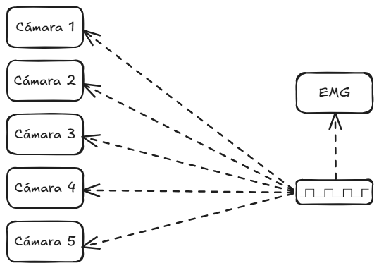
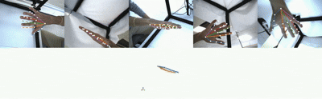

# Myorehab-UTP

## 🧠 Descripción

**MYOREHAB** es un sistema de análisis de movimiento orientado a la rehabilitación muscular. Utiliza tecnologías como **Anipose** (para triangulación 3D a partir de múltiples cámaras) y **MediaPipe** (para la detección de puntos clave en tiempo real).

---

### Pasos previos:

Antes de iniciar la adquisición de datos, asegúrese de completar y verificar los siguientes puntos:

#### 1. Sistema de Cámaras y Calibración
* [ ] **Fijar posición:** Asegurar la posición final e inclinación de todas las cámaras para evitar movimientos durante la sesión.
* [ ] **Calibración:** Realizar el proceso de calibración del sistema multicámara y verificar que los errores de reproyección estén dentro del rango aceptable ( <1).

#### 2. Configuración de Hardware
* [ ] **Matriz de electrodos:** Colocar correctamente la matriz de electrodos en el sujeto/modelo según el protocolo establecido.
* [ ] **Conexión de la Syncstation:** Conectar la *Syncstation* a la PC de adquisición y verificar la correcta detección de la matriz de electrodos.

#### 3. Validación del Sistema de Sincronización
* [ ] **Conexión al sistema embebido:** Validar que tanto las cámaras como la *Syncstation* estén correctamente conectadas al sistema embebido (Ver [`Diagrama 1`](imgs/sync_scheme_whitebg.png)).
* [ ] **Prueba de pulsos:** Ejecutar una prueba previa para confirmar que el sistema embebido:
  * Inicia la captura de las cámaras de forma síncrona.
  * Envía correctamente los pulsos de sincronización a la *Syncstation*.


<div align="center" id="diagrama-1">
  
  <p><em>Diagrama 1: Esquema de conexiones para la sincronización de modalidades.</em></p>
</div>


## Software utilizado para la adquisicion de datos:

* **IC-CAPTURE 2.5** 
* **OT BioLab +**

---

## 📁 1. Estructura del Proyecto 

La estructura inicial que almacena los datos de cada sujeto es la siguiente:

```bash
📂 PERSONA
├── raw-data/              # Los videos y archivos EMG originales se almacenan aquí
│   ├── cam1/              # Contiene +1 video de calibración por cámara
│   ├── cam2/
│   ├── cam3/
│   ├── cam4/
│   ├── cam5/
│   └── emg/
│
├── recording/
│   ├── calibration/       # Archivos de calibración de cámaras
│   ├── videos-raw/        # Videos sin procesar (entrada)
│   └── mediapipe_analyze.py # Script principal de análisis con MediaPipe
├── config.toml            # Archivo de configuración general
└── README.md
```

Esta estructura genera mediante el script [`001_structure.py`](utils/001_structure.py), el cual debe ser ejecutado para cada nuevo sujeto.

Una vez adquiridos los datos, es necesario renombrarlos. Tenga en cuenta las consideraciones de la siguiente sección antes de ejecutar los scripts [`002_rename_vid.py`](utils/002_rename_vid.py) y [`003_rename_emg.py`](utils/003_rename_emg.py) 

---
## Consideraciones antes de utilizar los scripts de renombrado

``` python
"""
1:DISTAL    ,   1:One F     ,   1:0 angle
2:PROXIMAL  ,   2:Two F     ,   2:45 angle
            ,   3:Full G    ,   3:90 angle
                            ,   4:135 angle
                            ,   5:180 angle
"""
order = [

    (0,0,0),
    (1,1,1), (1,1,2), (1,1,3), (1,1,4), (1,1,5),  #BLOCK A
    (2,1,1), (2,1,2), (2,1,3), (2,1,4), (2,1,5),  #BLOCK B
    (1,2,1), (1,2,2), (1,2,3), (1,2,4), (1,2,5),  #BLOCK C
    (2,2,1), (2,2,2), (2,2,3), (2,2,4), (2,2,5),  #BLOCK D
    (2,3,1), (2,3,2), (2,3,3), (2,3,4), (2,3,5),  #BLOCK E
    (1,3,1), (1,3,2), (1,3,3), (1,3,4), (1,3,5)   #BLOCK F
]
```

Este orden debe aleatorizarse para cada sujeto que se grabe. Posteriormente, se debe replicar exactamente la misma lista en ambos scripts de renombrado para asegurar la concordancia de los archivos.

### 1.1. Renombrar Videos

```python
python 002_rename_vid.py
```

**Aclaración:** Cada carpeta cam#, debería contar con 31 videos. **(1 de calibración + 30 de las condiciones)**.

El script  `rename_vid.py` solicita un input, por ejemplo:
* **Subject Number:** 1
* **Camera Number:** 1
* Selecciona la carpeta cam1/

Como resultado, se obtendrán los archivos con el formato: **S001-111-camA.mp4**

### 1.2. Renombrar archivos de Señales

```python
python 003_rename_emg.py
```

## 2. Organización y Procesamiento de Datos

Los videos y archivos EMG ya renombrados deben moverse a sus respectivas carpetas dentro de `/recording`

``` python
python 004_move_files.py D:/utils/004_move_files.py C:/dataset/S00#

# por default esta en copy, por lo que los archivos aun quedaran en raw-data por motivos de respaldo.
# el flag --mode move los movera por completo.
```

La estructura final tras el movimiento lucirá así:

``` bash
root_directory/
├── config.toml
└── recording/
    ├── calibration/          # 5 videos (1 por cámara)
    ├── emg/                  # 30 archivos de señales (.mat / .csv)
    ├── videos-raw/           # 150 videos (30 condiciones × 5 cámaras)
    └── mediapipe_analyze.py  # Script de análisis de MediaPipe
```

### 2.1. Detección de puntos con MediaPipe

```bash
# Debe ejecutarse dentro de la carpeta recordings/
python mediapipe_analyze.py
```

# EJECUTAR CON ENTORNO conda anipose

### 2.2. Calibración y triangulación con Anipose

```bash
anipose filter 

anipose calibrate # Debe generar .pickle en calibration/

anipose triangulate # Debe generar 30 .csv en pose-3d/

# Los pasos siguientes son para obtener los videos combinados + animacion.

anipose label-2d

anipose label-2d-filter

anipose label-3d

anipose label-combined
```

## 📽️ Resultados del Procesamiento (Label-Combined)

A continuación se muestra una demostración visual del resultado del pipeline (`label-combined`), el cual integra la reconstrucción de la pose 3D con las capturas sincronizadas de las distintas cámaras:

<div align="center">
  
  <p><em>Figura 1: Reconstrucción cinemática 3D combinada a partir del sistema multicámara.</em></p>
</div>


# Script de Automatización (Experimental).

Es, posible utilizar un script experimental, el cual ejecuta [`mediapipe_analyze.py`](utils/mediapipe_analyze.py) y el Pipeline de anipose: filter -> calibrate -> triangulate, es decir los puntos 2.1 y 2.2. Los puntos anteriores de renombrado y organización deben ser ejecutados manualmente.

* **Nota de compatibilidad:** Su correcto funcionamiento depende de la configuración del Sistema Operativo. Se ha   testeado en Windows 11 utilizando Git Bash dentro de Windows Terminal.

* El flujo requiere que MediaPipe se ejecute en el entorno base, mientras que Anipose se ejecuta de forma aislada en su propio entorno virtual.
---

## 3. Integración de Datos (Merge Data)
* Este script [`005_merge_data.py`](utils/005_merge_data.py) debe ubicarse en la ruta `S00#/recordings/` que es la ruta donde se encuentran las carpetas `pose-3d/` y `emg/`

```python
# auto detecta el canal de sync
python 005_merge_data.py --base .
```

Este script se debe correr de forma individual por cada sujeto procesado, ya que requiere la edición manual de su respectiva metadata en el código:

```python
S000["participantInfo"] = {
        "Age": "25",
        "Gender": "Male",
        "forearmPerimeter": "35",
        "Height": "180cm",
        "Laterality": "Right",
        "Injuries": "None",
    }
```

También es necesario modificar el identificador del paciente al final del script para guardar correctamente el archivo `.mat` de salida. Ej: `S001.mat`.

```python
    # Guardar
    S001 = S000
    print("Saving...")
    savemat(str(base / "S001.mat"), {"S001": S001}, do_compression=True)
    print("Done!")
```

## Reconocimientos:
Este proyecto ha sido financiado bajo la convocatoria conjunta EU-LAC-2022-123, de la SENACYT, Desarrollado en el Laboratorio de Visión e Inteligencia Artificial de la Universidad Tecnológica de Panamá.

## 📚 Fuentes y referencias

Durante el desarrollo del proyecto se consultaron las siguientes fuentes:

- [Documentación oficial de Anipose](https://anipose.readthedocs.io/en/latest/tutorial.html)